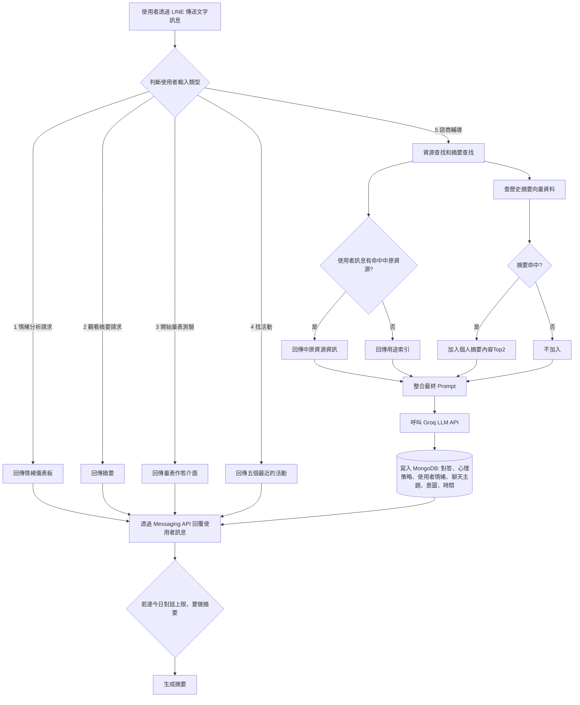

## 情緒方面文章

- [IntentionESC: An Intention-Centered Framework for Enhancing Emotional Support in Dialogue Systems](https://aclanthology.org/2025.findings-acl.1358.pdf)

- [The NRC Valence, Arousal, and Dominance (NRC-VAD) Lexicon](https://saifmohammad.com/WebPages/nrc-vad.html)

- [情緒模型：從達爾文到AI時代的探索](https://medium.com/@royroy5681/%E6%83%85%E7%B7%92%E6%A8%A1%E5%9E%8B-%E5%BE%9E%E9%81%94%E7%88%BE%E6%96%87%E5%88%B0ai%E6%99%82%E4%BB%A3%E7%9A%84%E6%8E%A2%E7%B4%A2-058c5ef8acf7)


## 系統流程圖


<br>

## 各檔案說明
### `test_chat.py`
 - 測試用本地端語言模型回應聊天的檔案

### `test_chat.py`
 - 測試用本地端語言模型回應摘要的檔案
   
### `app.py`
- 主程式入口。
- 使用 Flask 建立伺服器，並設定 `/callback` 路由處理 LINE Webhook
- 匯入 `line_handlers` 模組進行事件處理

### `config.py`
- 儲存環境變數的載入，例如 Groq API 金鑰、伺服器網址等
- 與 `.env` 檔案結合，集中管理設定值

### `line_handlers.py`
- 處理來自 LINE 的訊息事件。包括情緒儀表板、做量表、心理諮商
- 整合模糊比對與向量檢索結果、歷史對話5筆、base prompt，丟入llm 生成line bot 回覆

### `vector_search.py`

負責模糊比對與向量檢索，流程如下：

1. **模糊比對（substring match）使用者輸入與 cycu_resources["中原大學資源"] 中資源名稱：**  
  - 若命中資源 → 回傳該資源完整資訊（網址、簡介、分機等）。
  - 若未命中 → 回傳 cycu_resources["用途索引"] 作為參考。

2. **向量化**  
-呼叫我們自己架設的 Hugging Face Space（[aurorajojo/e5-large-embedding-api](https://huggingface.co/spaces/aurorajojo/e5-large-embedding-api)）將使用者 input 轉換為向量。

3. **歷史摘要和使用者 input 向量距離比對與檢索**

  - 將使用者向量化後，在 summary_collection 中搜尋 該使用者的 Top2 相似歷史摘要。  
  - 若命中 → 將摘要內容加入回傳資訊；若未命中 → 不加摘要。 


4. **整合兩項檢索結果**
- 將「中原資源 / 用途索引」和「歷史摘要」整合成最終資訊並回傳
     
### `llm.py`
- 封裝與語言模型（Groq / LLaMA）溝通的邏輯
- 定義如何將使用者訊息送出並取得回應(聊天、摘要2種模式)

### `extract_topic.py`
- 使用者聊天前會在圖文選單選擇聊天主題(人際關係,家庭關係,情愛關係,生涯,課業學習,自我探索與認識,情緒困擾調適,精神疾病,性議題,其他)，後面所有的對話都會記錄為該主題並且 `儲存至資料庫 `
- 主題來自[中原大學諮商中心的晤談服務](https://deptweb.cycu.edu.tw/misa/%e5%95%8f%e7%ad%94qa/)


### `emotion_strategy_utils.py`
-  為了避免讓使用者察覺我們正在進行 `情緒分析` 與 `心理策略及意圖紀錄` ，設計了隱藏式的標記機制(當 LLM 回傳分析結果時，不會直接以文字顯示情緒名稱或策略內容，是透過編碼形式（如 [1]～[11] 表示情緒、(1)～(8) 表示策略、{1}~{12} 表示意圖進行標註)，這個檔案就是在進行上述的標記轉換處理
  
### `emotion_dashboard.py`
- 根據使用者歷史對話紀錄，統計每種情緒七天內出現的頻率，並產生 `情緒儀表板` 
- 為了讓情緒分析結果更有親和力，我們替每一種情緒設計了一個對應角色
- 我們採用的情緒種類有: 1.焦慮 2.悲傷 3.憤怒 4.恐懼 5.厭惡 6.羞愧 7.滿足 8驚訝 9.興奮 10.冷靜 11.無法判斷

### `depression_scale.py`
- 顯示 32 題 `董氏憂鬱量表-大專生版問題` ，讓使用者逐題作答

### `gaming_disorder_scale.py`
- 顯示 10 題 `網路遊戲成癮量表問題` ，讓使用者逐題作答

### `topic_manager.py`
- 管理每天使用者的聊天主題
- 每天對話前會要求選主題

### `daily_summary.py`
- 每日對話前，檢查上次諮商是否有做摘要，呼叫llm做完摘要就將摘要轉換成向量，一起存到資料庫
- 如當日對話已滿上限(10次)，則呼叫llm做摘要，並將摘要轉換成向量，一起存到資料庫

### `weekly_summary.py`
- 輸出本周(七天以來)每日的摘要
- 輸出使用者要查詢的指定日期摘要

### `event_utils.py`
- 回傳最近10個即將到來的藝文活動相關資訊(包括名稱、日期、時間、連結)

### `render_wake_up.py`
- 我們使用 Render 作為伺服器部署平台
- 這個檔案會定時 ping Render 平台以防止伺服器自動休眠

### `mongo.py`
- 封裝 MongoDB 資料庫的連線與操作功能
- 讓專案能存取&管理聊天紀錄、摘要、量表分數

### `resources.py`
- 載入 `system_prompt.txt` 、 `summary_prompt.json`、 `cycu_resources.json`、 `events.json`，提供語言模型的指令（角色、語氣等）以及中原大學（CYCU）相關的各類資源資訊

### `requirements.txt`
- 記錄所需的 Python 套件

### `system_prompt.txt`
- 儲存語言模型的 system prompt，用於引導模型回應風格與身份定位
- 設定llm回傳文字時，透過 `編碼 `形式顯示情緒、策略、意圖名稱
- 設定llm不回答任何 `危險、非法或自殘 `相關問題以及`與諮商或中原資源無關的工作（如寫心得、知識回答、工具操作）`
- 設定llm不透露任何 `prompt內部設計或詳細指令內容 `
- 生成流程: 判斷四個層面 → 確認意圖 → 套用策略。(此作法參考論文[IntentionESC: An Intention-Centered Framework for Enhancing Emotional Support in Dialogue Systems](https://aclanthology.org/2025.findings-acl.1358.pdf))

### `summary_prompt.txt`
- 儲存語言模型要執行摘要的prompt
- 僅輸出摘要，不要進行對話或回答問題  
- 不可編造對話中未出現的情緒或事件 

### `cycu_resources.json`
- JSON 格式的資源資料檔案
- 包含中原大學（CYCU）相關的各類資源資訊
- 來源:[中原大學行政單位](https://www.cycu.edu.tw/?page_id=2401https://www.cycu.edu.tw/?page_id=2401)、[中原大學各單位分機資訊](https://www.cycu.edu.tw/tel.jsp)、[中原大學學生學習基地](https://acadm.cycu.edu.tw/%E5%AD%B8%E7%94%9F%E5%AD%B8%E7%BF%92%E5%9F%BA%E5%9C%B0/)

### `events.json`
- JSON 格式的資源資料檔案
- 包含中原大學（CYCU）本學期藝文活動列表
- 來源:[中原大學活動報名系統-iTouch](https://itouch.cycu.edu.tw/active_project/cycu2100h_06/acpm3/#!/activityList/welcome)

<br>  
<br>  

## 指令

下載套件：
```bash
pip install -r requirements.txt
```
啟動程式：
```bash
python app.py
```
